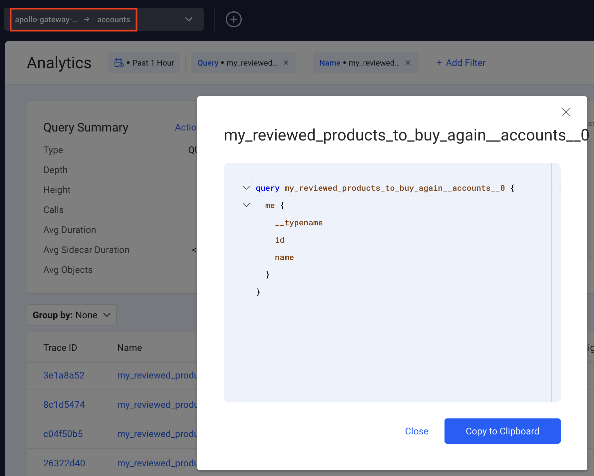

# Apollo Gateway + Inigo Demo
> This demo currently uses Apollo Server v3 and Apollo Gateway v2 which are deprecated.

## Apollo Gateway Demo Application Setup

This demo showcases four partial schemas running as federated microservices. Inigo will be added to provide observability to the federated graph.

To learn more about Apollo Federation, check out the [docs](https://www.apollographql.com/docs/apollo-server/federation/introduction).

### Demo Installation

To run this demo locally, pull down the repository then run the following commands:

```sh
cd apollo-gateway-demo
npm install
```

### Run Demo Microservices

This will install all of the dependencies for the gateway and each underlying service.

```sh
npm run start-services
```

This command will run all of the microservices at once. They can be found at http://localhost:4001, http://localhost:4002, http://localhost:4003, and http://localhost:4004.

### Sample GraphQL Queries for Individual Services

#### Accounts Service Sample Query

Here is the GraphQL schema for Accounts:

```graphql
  extend type Query {
    me: User
  }

  type User @key(fields: "id") {
    id: ID!
    name: String
    username: String
  }
```

Go to http://localhost:4001

```graphql
query me {
  me {
    name,
    username
  }
}
```

#### Products Service Sample Query

Here is the GraphQL schema for Products:

```graphql
  extend type Query {
    topProducts(first: Int = 5): [Product]
  }

  type Product @key(fields: "upc") {
    upc: String!
    name: String
    price: Int
    weight: Int
  }
```

Go to http://localhost:4003

```graphql
query topProducts {
  topProducts {
    name,
    price,
    weight,
    upc
  }
}
```

#### Inventory Service Federated Schema

Inventory extends `Product` with inventory information about the product. Here is the federated schema:

```graphql
  extend type Product @key(fields: "upc") {
    upc: String! @external
    weight: Int @external
    price: Int @external
    inStock: Boolean
    shippingEstimate: Int @requires(fields: "price weight")
  }
```

#### Reviews Service Federated Schema

Reviews provides the federated GraphQL schema that ties together `Review`, `User`, and `Product`.

```graphql
  type Review @key(fields: "id") {
    id: ID!
    body: String
    author: User @provides(fields: "username")
    product: Product
  }

  extend type User @key(fields: "id") {
    id: ID! @external
    username: String @external
    reviews: [Review]
  }

  extend type Product @key(fields: "upc") {
    upc: String! @external
    reviews: [Review]
  }
```


### Run Apollo Gateway

In another terminal window, run the gateway by running this command:

```sh
cd apollo-gateway-demo
npm run start-gateway
```

This will start up the gateway and serve it at http://localhost:4000, where the GraphQL Sandbox will be available.

#### Run Sample Federated GraphQL Query

This `my_reviewed_products_to_buy_again` query will hit all 4 GraphQL microservices in one query.

```graphql
query my_reviewed_products_to_buy_again {
  me {
    name
    reviews {
      product {
        name
        price
        shippingEstimate
        inStock
      }
      review: body
    }
  }
}
```

## Inigo Setup

### Install the CLI

```shell
brew tap inigolabs/homebrew-tap
brew install inigo_cli
```

### Login to Inigo via the CLI

```shell
inigo login google
```
or
```shell
inigo login github
```

### Setup the Inigo `Service` and `Gateway`

You must use the Inigo CLI to create a `Service` and apply a `Gateway` configuration to set up this demo.

```shell
inigo create service apollo-gateway-demo
inigo create token apollo-gateway-demo
```

Keep the token handy! You will need it when deploying Apollo Gateway with Inigo.

```shell
inigo apply inigo/gateway.yml
```

The `gateway.yaml` configuration sets up the subgraph services and looks like this:

```yaml
kind: Gateway
name: apollo-gateway-demo
spec:
  services:
    - name: accounts
      url: "http://localhost:4001/graphql"
    - name: reviews
      url: "http://localhost:4002/graphql"
    - name: products
      url: "http://localhost:4003/graphql"
    - name: inventory
      url: "http://localhost:4004/graphql"
```

Now when you run `inigo get service` you should see `apollo-gateway-demo` with its subgraph services:

```shell
inigo get service
NAME                 LABEL      INSTANCES  STATUS
----                 -----      ---------  ------
apollo-gateway-demo             0          Not Running
- accounts                      0          Not Running
- reviews                       0          Not Running
- products                      0          Not Running
- inventory                     0          Not Running
```

Now Inigo is prepared for your subgraphs!

## Apollo Gateway Setup

### Install the NPM Modules

```
npm install inigo.js
```
Pick one of the following, depending on your OS and CPU:
```
npm install inigo-linux-amd64
npm install inigo-linux-arm64
npm install inigo-darwin-amd64
npm install inigo-darwin-arm64
npm install inigo-windows-amd64
npm install inigo-darwin-arm64
```

### Make the code changes.

Open `gateway.js` in your favorite JavaScript editor. In the file, you will see, for your convenience, comment blocks of code that are necessary to setup Inigo. 

You must uncomment every block of code under each `//INIGO:` comment, for example:

```js
// INIGO: Uncomment below:
const { InigoPlugin, InigoRemoteDataSource, InigoFetchGatewayInfo } = require("inigo.js");
```

When you uncomment these lines of code, notice what the purpose is of each. When they are all uncommented, you will be able to run Apollo Gateway with the Inigo agent installed and configured for it.

### Restart the Apollo Gateway

Now that Inigo is installed, in the terminal currently running the Apollo Gateway, `CTRL+C` to stop it.

### Run the Gateway with `INIGO_SERVICE_TOKEN`

```sh
export INIGO_SERVICE_TOKEN="ey..."
npm run start-gateway
```

> You will see additional logging statements coming from Inigo via the Apollo Gateway. You can ignore these logs unless some problem occurs.

Optionally, you can check the service again to see that it's `Running`.

```sh
inigo get service                       
NAME                 LABEL      INSTANCES  STATUS
----                 -----      ---------  ------
apollo-gateway-demo             1          Running
- accounts                      1          Running
- reviews                       1          Running
- products                      1          Running
- inventory                     1          Running
```

Go to the Apollo Sandbox again at http://localhost:4000


Run the `my_reviewed_products_to_buy_again` query again to hit all 4 GraphQL microservices. The data from this federated query execution will now be forwarded to Inigo!

```graphql
query my_reviewed_products_to_buy_again {
  me {
    name
    reviews {
      product {
        name
        price
        shippingEstimate
        inStock
      }
      review: body
    }
  }
}
```

Now run the query several time to send additional data to Inigo.

> Note: It wll likely take a moment or two for the data to show up in Inigo. Please be patient!

### Viewing the Results in Inigo

In https://app.inigo.io you will be able to view the federated GraphQL query that you run, the subgraph GraphQL queries, and Inigo Analytics independently for each of them.





