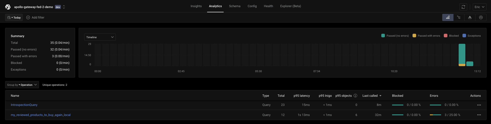
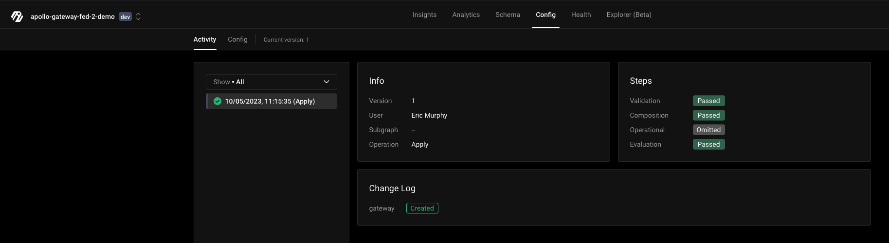
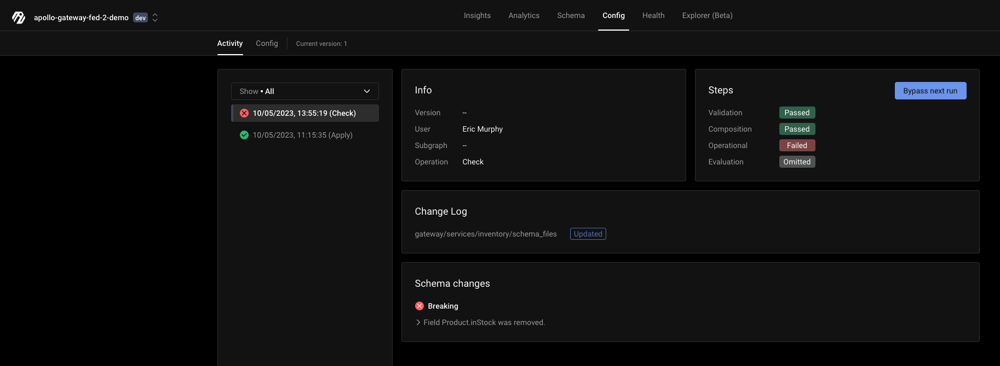
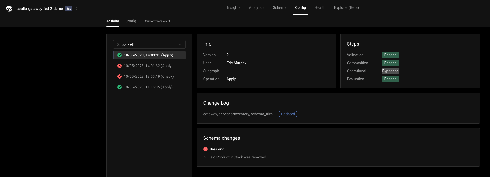
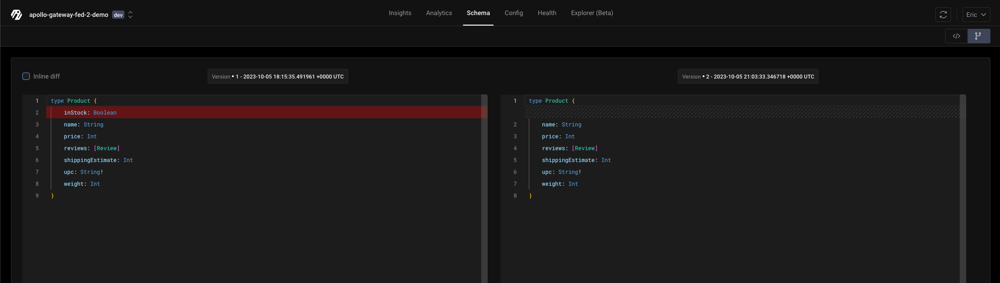
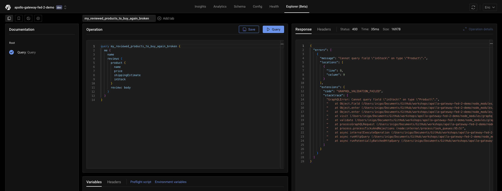

# Apollo Gateway + Apollo Federation 2.x + Inigo Demo

This demo application showcases four subgraph schemas running as federated GraphQL microservices. Inigo will be added to provide analytics and management of the federated graph.

This guide will walk through the step-by-step of how to configure and run Apollo Federation 2.0 with Inigo and Apollo Gateway, and covers how to do local composition and pushing to Inigo's schema registry. in this scenario, a breaking change will be introduced, forcefully published, and then rolled back.

## Part A: Apollo Gateway Demo Application Setup

This demo application uses Apollo Gateway and Apollo Server for the 4 subgraph microservices. All of the commands to build and start the services use `npm`.

### Run NPM Install

```
cd apollo-gateway-fed-2-demo
npm install
```


### Install the NPM Modules for Inigo

Pick one of the following, depending on your OS and CPU:
```
npm install inigo-linux-amd64
npm install inigo-linux-arm64
npm install inigo-darwin-amd64
npm install inigo-darwin-arm64
npm install inigo-windows-amd64
npm install inigo-darwin-arm64
```

### Run Demo GraphQL Subgraph Microservices

This command will run all of the GraphQL Subgraph microservices at once:

```sh
npm run start-services
```

They will be running at http://localhost:4001, http://localhost:4002, http://localhost:4003, and http://localhost:4004.

## Part B: Inigo Setup

Open a new terminal (to keep the GraphQL subgraph services running) and `cd` back into this project directory.

```
cd apollo-gateway-fed-2-demo
```

### Install the Inigo CLI (If Not Installed)

```shell
brew tap inigolabs/homebrew-tap
brew install inigo_cli
```

or if already installed, upgrade to at minimum version 0.28.1:

```
brew upgrade inigo_cli
```

### Login to Inigo via the CLI

```shell
inigo login (google or github)
```

### Setup the Inigo `Service` and get a  token

You can use the Inigo CLI to create a `Service` and apply a `Gateway` configuration to set up this demo. This could also be done through the UI.

```shell
inigo create service apollo-gateway-fed-2-demo:dev
inigo create token apollo-gateway-fed-2-demo:dev
```

Copy the token, which will look like `eyJhbGciOiJIUzU...`. **Keep the token handy!** You will need it when deploying Apollo Gateway with Inigo.

### Apply the Inigo `Gateway` and `Subgraph`s

```shell
inigo apply inigo/gateway.yaml --label dev
```

The `gateway.yaml` configuration sets up the `Gateway` and looks like this:

```yaml
kind: Gateway
name: apollo-gateway-fed-2-demo
spec:
  composition: ApolloFederation_v2
```

The subgraphs can optionally be broken out into their `Subgraph` definitions. For example, here is the accounts subgraph that is located in 
`services/accounts/subgraph.yaml`.

```yaml
kind: Subgraph
name: apollo-gateway-fed-2-demo
spec: 
  gateway: apollo-gateway-fed-2-demo
  url: "http://localhost:4001/graphql"
  schema_files:
  - ./schema.graphql
```

```shell
inigo apply services/accounts/subgraph.yaml --label dev
inigo apply services/inventory/subgraph.yaml --label dev
inigo apply services/products/subgraph.yaml --label dev
inigo apply services/reviews/subgraph.yaml --label dev
```

Now when you run `inigo get service` you should see `apollo-gateway-fed-2-demo:dev` with its subgraph services, but they will not yet be running:

```shell
inigo get service
NAME                       LABEL     INSTANCES  STATUS
----                       -----     ---------  ------
apollo-gateway-fed-2-demo  dev       0          Not Running
- accounts                 dev       0          Not Running
- reviews                  dev       0          Not Running
- products                 dev       0          Not Running
- inventory                dev       0          Not Running
```

## Part C: Inigo Setup for Apollo Federation Local Composition

### Setup the `.env` for Local Composition

Copy the `.env.sample` to `.env` and add your `INIGO_SERVICE_TOKEN`. 

You can leave the `LOCAL_COMPOSED_SCHEMA=supergraph.graphql` for now unless you want a different file name.

## Run the Local Composition to Generate the Federated Schema

```shell
inigo compose inigo/local.compose.yaml > supergraph.graphql
```

### Start the Apollo Gateway

```sh
npm run start-gateway
```

> Note: You will see logging statements coming from the Inigo sidecar while running the Apollo Gateway. You can ignore these logs unless some problem occurs.

Go to the Apollo Sandbox at http://localhost:4000 or configure the Inigo Explorer to call http://localhost:4000.

Run the `my_reviewed_products_to_buy_again_local` query. This query runs against all 4 GraphQL microservices.

```graphql
query my_reviewed_products_to_buy_again_local {
  me {
    name
    reviews {
      product {
        name
        price
        shippingEstimate
        inStock
      }
      review: body
    }
  }
}
```

After you run the query several times and then go to Inigo Analytics, you will be able to see analytics data for `my_reviewed_products_to_buy_again_local`.



## Part D: Inigo Setup for Apollo Federation Schema Registry

### Publishing a Schema for the First Time

The next step, after running with a locally composed schema, is to publish your schema to the Inigo schema registry. This can be done with the following command:

```shell
inigo publish apollo-gateway-fed-2-demo:dev
```

Here is the expected output for the first time you publish a schema:

```
apollo-gateway-fed-2-demo % inigo publish apollo-gateway-fed-2-demo:dev
Schema v1 published successfully!
```

On the Inigo UI you can see the pubish result under `Config` -> `Activity`.




### Reconfigure and Restart Apollo Gateway to Use Published Schema

Edit the `.env` to comment out or remove `LOCAL_COMPOSED_SCHEMA=supergraph.graphql`, as we no longer want to use the locally composed schema.

Run `npm run start-gateway` again and this is the expected output, with schema v1 being pulled:

```
npm run start-gateway

> start-gateway
> nodemon gateway.js

[nodemon] 3.0.1
[nodemon] to restart at any time, enter `rs`
[nodemon] watching path(s): *.*
[nodemon] watching extensions: js,mjs,cjs,json
[nodemon] starting `node gateway.js`
⛅  You're using a federated schema pulled from Inigo's schema repository
{"level":"info","config":{"DeploymentEnv":"","SidecarEnable":true,"ListenPort":"80","EgressURL":"","EgressAuth":{"Headers":null},"ServiceURL":"https://app.inigo.io/agent/query","StorageURL":"https://storage-service-prod-tntxobsskq-uc.a.run.app/query","LoadgenURL":"","ServiceToken":"****","GraphQLPlaygroundRoute":"","SidecarInfoRoute":"","SubscriptionProcessingEnabled":false,"ServiceSubscriptionEnabled":false,"PassThroughURL":"","PostProcess":{"QueueBuffer":5000,"WorkerCount":1},"SchemaFetch":{"IntrospectionFile":"","Source":"sdl","UploadOnIntrospection":false},"UploadMaxTries":5,"UploadChunkSize":8388608,"UploadQueueLimit":1000,"UploadCompression":"s2","WorkersNumber":10,"SidecarJWTSecret":"","JWKSEndpoint":"","ClusterAddress":"","TelemetryEnable":false,"TelemetryLevel":0,"TelemetryDebug":false,"TelemetrySampleDuration":60000000000,"TelemetrySampleInterval":300000000000,"TelemetryProfiles":"","OpenTelemetry":{"Enabled":false,"ServiceName":"Eric/apollo-gateway-fed-2-demo/dev","Endpoint":"","Insecure":false}},"time":"2023-10-05T14:23:10-07:00","caller":"./main.go:161"}
InigoSchemaManager: new schema v1 pulled.
🚀  Supergraph ready at http://localhost:4000/
...
```

## Part E: Introduce and Rollback a Breaking Change

### Introduce a Breaking Schema Change

1. Remove `inStock: Boolean` from the `apollo-gateway-fed-2-demo/services/inventory/schema.graphql` schema file.
2. Run the check command:
```shell
inigo check services/inventory/subgraph.yaml --label dev
```
The expected output will be:
```
apollo-gateway-fed-2-demo % inigo check services/inventory/subgraph.yaml
Service: apollo-gateway-fed-2-demo:dev

Changelog:
----------
gateway/services/inventory/schema_files  updated  

Steps:
------
Validation:   passed
Composition:  passed
Operational:  failed
Evaluation:   omitted

Detected 1 breaking change(s), 0 non-breaking change(s).
New schema is validated against traffic from Tue, 05 Sep 2023 13:55:19 PDT.

Schema changes:
---------------
BREAKING: Field Product.inStock was removed.
  Location: composed:26:2
    -   inStock: Boolean
  Usage
  no usage


Execute the below command to ignore this failure on the next run:
>  inigo bypass check 1a8e3e373fb394bc128656dd8c37a9836b84c5c2

Check out the report in the UI:
https://app.inigo.io/000/config/activity/2876

error: check failed, see report above for details
```

On the Inigo UI you can see the breaking change result under `Config` -> `Activity`.




### Override and Publish a Breaking Change
If you are confident that your breaking change will not impact your clients and you would like to override and publish, this is possible by running the following commands:

1. Run the apply command for the gateway:
```shell
inigo apply services/inventory/subgraph.yaml --label dev
```
The expected output of the command will be:
```
apollo-gateway-fed-2-demo % inigo apply services/inventory/subgraph.yaml --label dev
Service: apollo-gateway-fed-2-demo:dev

Changelog:
----------
gateway/services/inventory/schema_files  updated  

Steps:
------
Validation:   passed
Composition:  passed
Operational:  failed
Evaluation:   omitted

Detected 1 breaking change(s), 0 non-breaking change(s).
New schema is validated against traffic from Tue, 05 Sep 2023 14:01:32 PDT.

Schema changes:
---------------
BREAKING: Field Product.inStock was removed.
  Location: composed:26:2
    -   inStock: Boolean
  Usage
  no usage


Execute the below command to ignore this failure on the next run:
>  inigo bypass apply 1a8e3e373fb394bc128656dd8c37a9836b84c5c2

Check out the report in the UI:
https://app.inigo.io/000/config/activity/2878

error: check failed, see report above for details
```

2. Run the apply commands to override:
```shell
inigo bypass apply 1a8e3e373fb394bc128656dd8c37a9836b84c5c2
inigo apply services/inventory/subgraph.yaml --label dev
```
The expected output of the commands will be:
```
inigo bypass apply 1a8e3e373fb394bc128656dd8c37a9836b84c5c2
inigo apply services/inventory/subgraph.yaml --label dev
Feel free to re-run 'apply' of the same config again!
Service: apollo-gateway-fed-2-demo:dev

Changelog:
----------
gateway/services/inventory/schema_files  updated  

Steps:
------
Validation:   passed
Composition:  passed
Operational:  bypassed
Evaluation:   passed

Detected 1 breaking change(s), 0 non-breaking change(s).
New schema is validated against traffic from Tue, 05 Sep 2023 14:03:33 PDT.

Schema changes:
---------------
BREAKING: Field Product.inStock was removed.
  Location: composed:26:2
    -   inStock: Boolean
  Usage
  no usage

New config version 2 is applied 🎉

Check out the report in the UI:
https://app.inigo.io/000/config/activity/2879
```

On the Inigo UI you can see that schema version 2 was applied and that the `Operational` check was bypassed.



3. Run the publish command to make the new version of the schema operational:
```shell
inigo publish apollo-gateway-fed-2-demo:dev
```
The expected output of the command will be:
```
inigo publish apollo-gateway-fed-2-demo:dev
Schema v2 published successfully!
```

You can now see that schema v2 is published and that the `inStock` field was removed with Inigo's schema diff view.



In your Apollo Gateway logs you should have a log containing the message:

```
applySchema : new schema is reported
```

Apollo Gateway is now dynamically reconfigured to use v2 of the schema. This can be proven by running a query that contains the `inStock` field.



### Rollback a Breaking Change

If a mistake was made, and you want to move back to a previous version of the schema, this can be easily accomplished with the following command:

```shell
inigo publish apollo-gateway-fed-2-demo:dev 1 --force
```
The expected output will be:

```
apollo-gateway-fed-2-demo % inigo publish apollo-gateway-fed-2-demo:dev 1 --force
Schema v1 published successfully!
```

In your Apollo Gateway logs you should have a log containing the message:

```
applySchema : new schema is reported
```

> IMPORTANT: There is currently an outstanding issue that prevents the rollback from being applied dynamically. You can restart the Gateway to apply the v1 change until this is resolved.
> ```shell
> npm run start-gateway
> ```

## Part F: Clean Up

Shut down the Apollo Gateway to disconnect the agent. You must wait about 10 minutes to no longer be in a `Running` state before you can `delete`.

```shell
inigo delete service apollo-gateway-fed-2-demo:dev
inigo delete service accounts:dev
inigo delete service reviews:dev
inigo delete service products:dev
inigo delete service inventory:dev
```