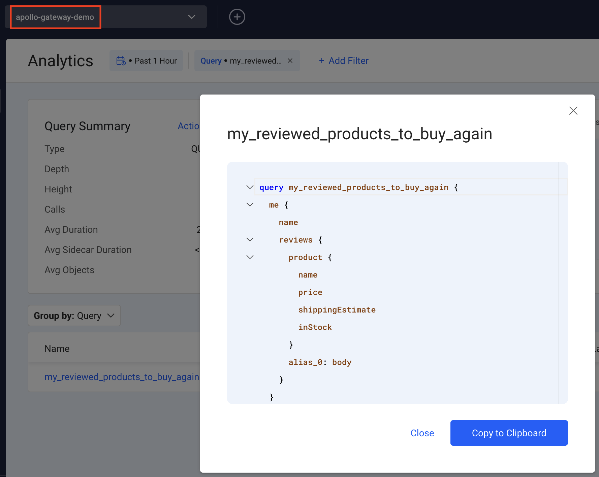
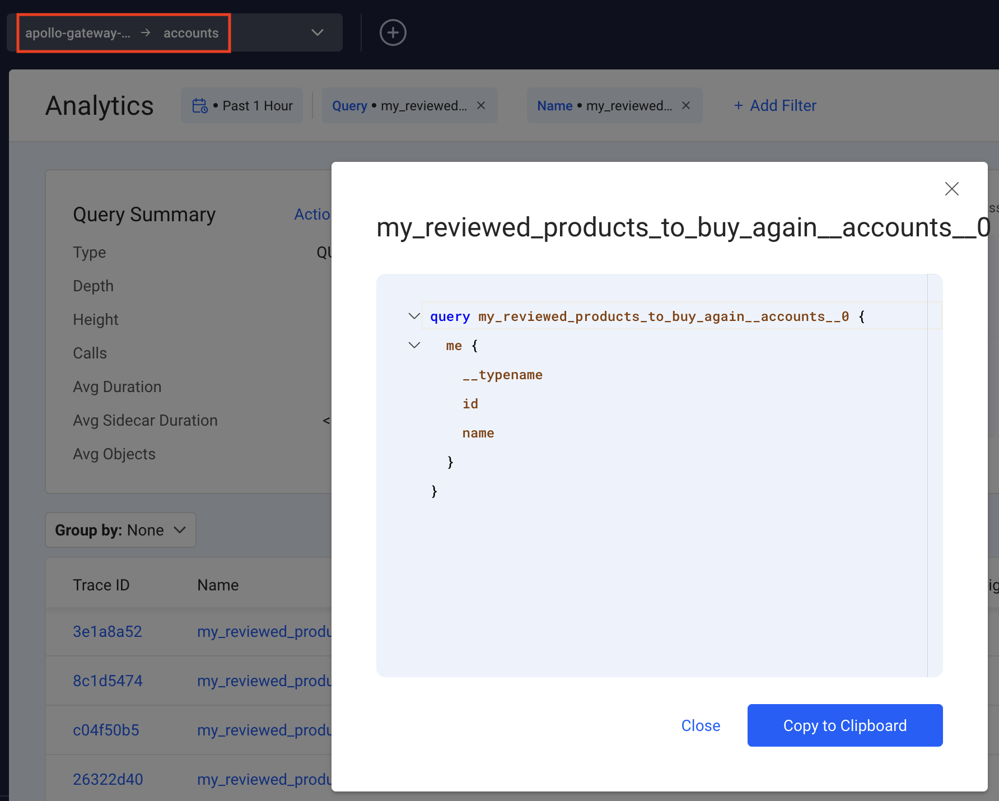
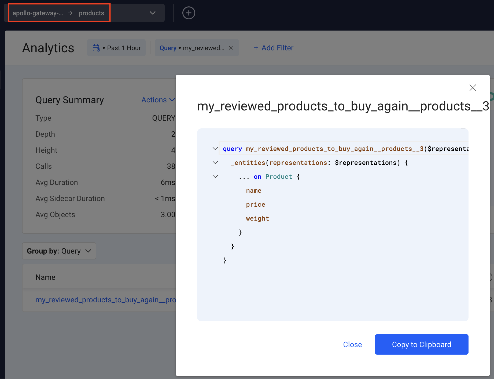
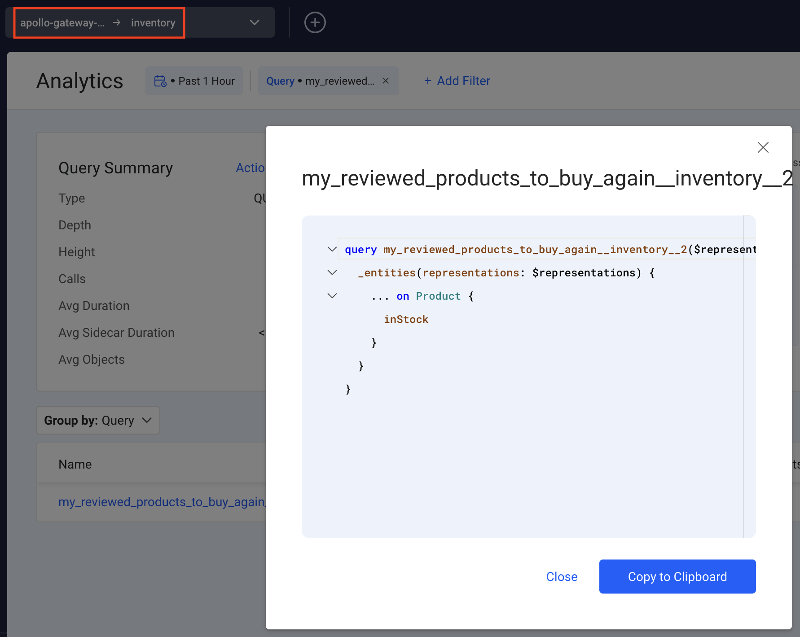
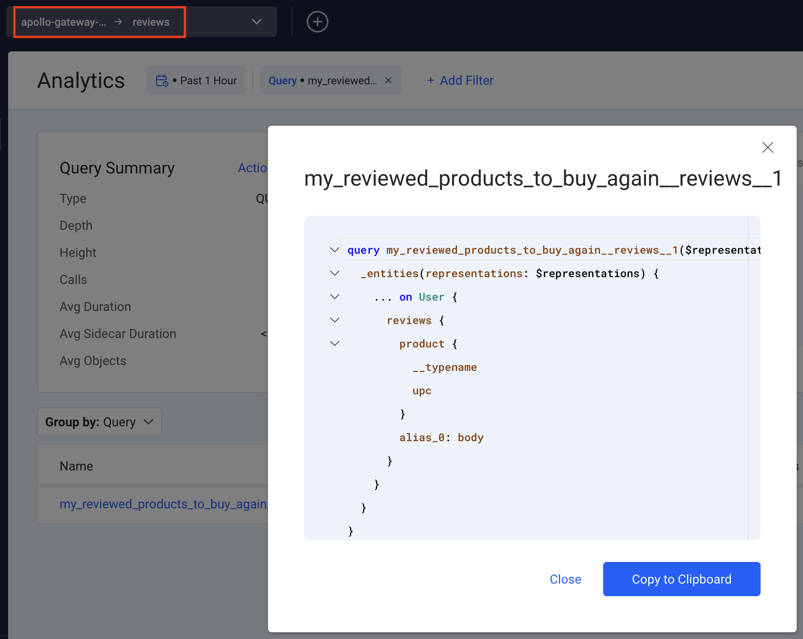

# Apollo Gateway + Apollo Federation 2.x + Inigo Demo

You may jump ahead [Inigo Setup](inigo-setup) if you already have this project running and already know how Apollo Gateway works.

## Apollo Gateway Demo Application Setup

This demo showcases four subgraph schemas running as federated GraphQL microservices. Inigo will be added to provide anaytics and management of the federated graph.

### Run NPM Install

```
npm install
```


### Install the NPM Modules for Inigo

Pick one of the following, depending on your OS and CPU:
```
npm install inigo-linux-amd64
npm install inigo-linux-arm64
npm install inigo-darwin-amd64
npm install inigo-darwin-arm64
npm install inigo-windows-amd64
npm install inigo-darwin-arm64
```

### Run Demo Microservices

This will install all of the dependencies for the gateway and each underlying service.

```sh
npm run start-services
```

This command will run all of the microservices at once. They can be found at http://localhost:4001, http://localhost:4002, http://localhost:4003, and http://localhost:4004.


## Inigo Setup

### Install the CLI

```shell
brew tap inigolabs/homebrew-tap
brew install inigo_cli
```

or if already installed, upgrade to at minimum >=0.28.1:

```
brew upgrade inigo_cli
```

### Login to Inigo via the CLI

```shell
inigo login (google or github)
```

### Setup the Inigo `Service`, token, and `Gateway`

You must use the Inigo CLI to create a `Service` and apply a `Gateway` configuration to set up this demo.

```shell
inigo create service apollo-gateway-fed-2-demo:dev
inigo create token apollo-gateway-fed-2-demo:dev
```

Keep the token handy! You will need it when deploying Apollo Gateway with Inigo.

```shell
inigo apply inigo/gateway.yaml
```

The `gateway.yaml` configuration sets up the subgraph services and looks like this:

```yaml
kind: Gateway
name: apollo-gateway-fed-2-demo
label: dev
spec:
  composition: ApolloFederation_v2
  services:
    - name: accounts
      url: "http://localhost:4001/graphql"
      schema_files:
      - ../services/accounts/schema.graphql
    - name: reviews
      url: "http://localhost:4002/graphql"
      schema_files:
      - ../services/reviews/schema.graphql
    - name: products
      url: "http://localhost:4003/graphql"
      schema_files:
      - ../services/products/schema.graphql
    - name: inventory
      url: "http://localhost:4004/graphql"
      schema_files:
      - ../services/inventory/schema.graphql
```

Now when you run `inigo get service` you should see `apollo-gateway-fed-2-demo` with its subgraph services:

```shell
inigo get service
NAME                       LABEL     INSTANCES  STATUS
----                       -----     ---------  ------
apollo-gateway-fed-2-demo  dev       0          Not Running
- accounts                 dev       0          Not Running
- reviews                  dev       0          Not Running
- products                 dev       0          Not Running
- inventory                dev       0          Not Running
```

TODO Publish Subgraph


### Start the Apollo Gateway

### Run the Gateway with `INIGO_SERVICE_TOKEN`

```sh
export INIGO_SERVICE_TOKEN="ey..."
npm run start-gateway
```

> You will see additional logging statements coming from Inigo via the Apollo Gateway. You can ignore these logs unless some problem occurs.

Optionally, you can check the service again to see that it's `Running`.

```sh
inigo get service                       
NAME                 LABEL      INSTANCES  STATUS
----                 -----      ---------  ------
apollo-gateway-demo             1          Running
- accounts                      1          Running
- reviews                       1          Running
- products                      1          Running
- inventory                     1          Running
```

Go to the Apollo Sandbox again at http://localhost:4000


Run the `my_reviewed_products_to_buy_again` query again to hit all 4 GraphQL microservices. The data from this federated query execution will now be forwarded to Inigo!

```graphql
query my_reviewed_products_to_buy_again {
  me {
    name
    reviews {
      product {
        name
        price
        shippingEstimate
        inStock
      }
      review: body
    }
  }
}
```

Now run the query several times to send additional data to Inigo.

> Note: It wll likely take a moment or two for the data to show up in Inigo. Please be patient!

### Viewing the Results in Inigo

In https://app.inigo.io you will be able to view the federated GraphQL query that you run, the subgraph GraphQL queries, and Inigo Analytics independently for each of them.

Here are screenshots showing the specific outputs for the federated GraphQL query. The red boxes show the menu where the Services are selected. This will help you navigate to the correct location in Inigo.











In each Service and subgraph Service, you can explore each of the queries independently to learn about their performance and utilization attributes.

# Clean Up

Shut down the Apollo Gateway to disconnect the agent. Wait 10 minutes.

```shell
inigo delete service apollo-gateway-demo
inigo delete service accounts
inigo delete service reviews
inigo delete service products
inigo delete service inventory
```

This process will be simplified in an upcoming release of Inigo.