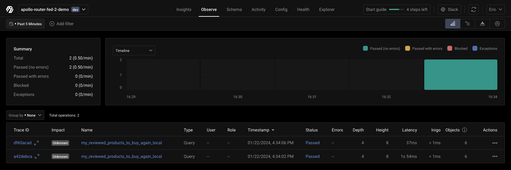
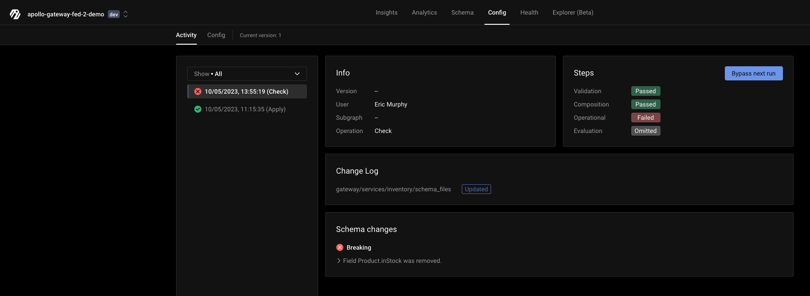
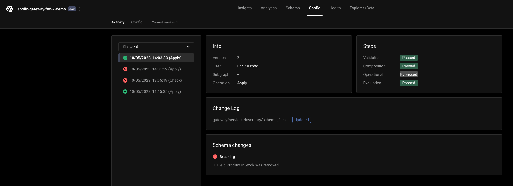
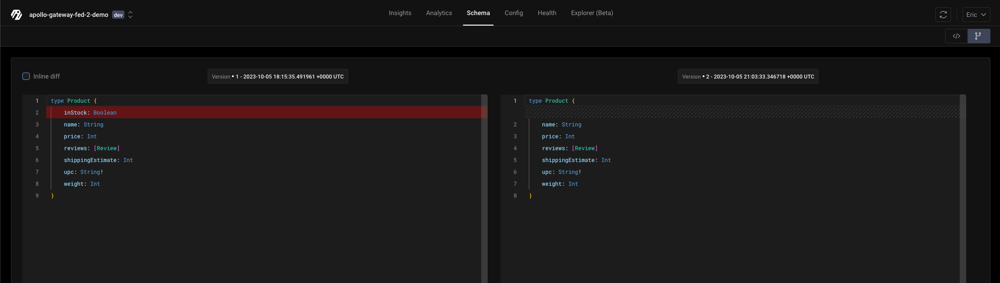
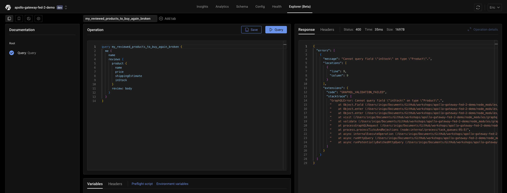

# Apollo Router + Apollo Federation 2.x + Inigo Demo

This demo application showcases four subgraph schemas running as federated GraphQL microservices. Inigo will be added to provide analytics and management of the federated graph.

This guide will walk through the step-by-step of how to configure and run Apollo Federation 2.0 with Inigo and Apollo Router, and covers how to do local composition and pushing to Inigo's schema registry. In this scenario, a breaking change will be introduced, forcefully published, and then rolled back.

## Part A: Apollo Router Demo Application Setup

This demo application uses Apollo Router and Apollo Server for the 4 subgraph microservices. All of the commands to build and start the services use `npm`.

### Run NPM Install

```
cd apollo-router-fed-2-demo
npm install
```

### Run Demo GraphQL Subgraph Microservices

This command will run all of the GraphQL Subgraph microservices at once:

```sh
npm run start-services
```

The subgraph services will be running at http://localhost:4001, http://localhost:4002, http://localhost:4003, and http://localhost:4004.

## Part B: Inigo CLI and Service Setup

Open a new terminal (to keep the GraphQL subgraph services running) and `cd` back into this project directory.

```
cd apollo-router-fed-2-demo
```

### Install the Inigo CLI (If Not Installed)

```shell
brew tap inigolabs/homebrew-tap
brew install inigo_cli
```

or if already installed, upgrade to at minimum version 0.29.0:

```
brew upgrade inigo_cli
```

### Login to Inigo via the CLI

```shell
inigo login (google or github)
```

### Setup the Inigo `Service` and get a  token

You can use the Inigo CLI to create a `Service` and apply a `Gateway` configuration to set up this demo. This could also be done through the UI.

```shell
inigo create service apollo-router-fed-2-demo:local
inigo create token apollo-router-fed-2-demo:local
```

Copy the token, which will look like `eyJhbGciOiJIUzU...`. **Keep the token handy!** You will need it when deploying Apollo Router with Inigo.

### Setup `router.yaml` Configuration for Apollo Router

Create a `router.yaml` from the `router.yaml.sample` template. Add your Inigo service token to replace the `ADD_TOKEN_HERE` value.

### Apply the Inigo `Gateway` and `Subgraph`s

```shell
inigo apply inigo/gateway.yaml --label local
```

The `gateway.yaml` configuration sets up the `Gateway` and looks like this:

```yaml
kind: Gateway
name: apollo-router-fed-2-demo
spec:
  composition: ApolloFederation_v2
```

The subgraphs can optionally be broken out into their `Subgraph` definitions. For example, here is the accounts subgraph that is located in 
`services/accounts/subgraph.yaml`.

```yaml
kind: Subgraph
name: accounts
spec: 
  gateway: apollo-router-fed-2-demo
  url: "http://host.docker.internal:4001/graphql"
  schema_files:
  - ./schema.graphql
```

> **Note:** Using `host.docker.internal` is necessary rather than using `localhost` because Apollo Router is running inside of a Docker container.

Using the `inigo` CLI, you can apply the `Subgraph` YAML configurations. Run each command individually (to give a few seconds for each to be fully applied) as such:

```shell
inigo apply services/products/subgraph.yaml --label local
```

```shell
inigo apply services/accounts/subgraph.yaml --label local
```

```shell
inigo apply services/inventory/subgraph.yaml --label local
```

```shell
inigo apply services/reviews/subgraph.yaml --label local
```

Now when you run `inigo get service` you should see `apollo-router-fed-2-demo:local` with its subgraph services, but they will not yet be running:

```shell
inigo get service
NAME                      LABEL    INSTANCES  STATUS
----                      -----    ---------  ------
apollo-router-fed-2-demo  local    0          Not Running
- products                local               
- accounts                local               
- inventory               local               
- reviews                 local               
```

## Part C: Inigo Setup for Apollo Federation Local Composition

### Run the Local Composition to Generate the Federated Schema

```shell
inigo compose inigo/local.compose.yaml > supergraph.graphql
```

### Start the Apollo Router

```sh
docker run --rm -p 4000:8080  \
-v ${PWD}/router.yaml:/dist/config/router.yaml \
-v ${PWD}/supergraph.graphql:/dist/config/supergraph.graphql \
-e APOLLO_ROUTER_CONFIG_PATH=/dist/config/router.yaml \
-e APOLLO_ROUTER_SUPERGRAPH_PATH=/dist/config/supergraph.graphql \
-e INIGO_REGISTRY_ENABLED=false \
--name router-local inigohub/inigo_apollo_router:latest
```

> **Note:** You will see logging statements coming from the Inigo sidecar while running the Apollo Gateway. You can ignore these logs unless some problem occurs.

Go to Inigo Explorer (https://app.inigo.io and go to your Service -> Explorer) and configure it to call http://localhost:4000. You may use any GraphQL client, however.

Run the `my_reviewed_products_to_buy_again_local` query. This query runs against all 4 GraphQL microservices.

```graphql
query my_reviewed_products_to_buy_again_local {
  me {
    name
    reviews {
      product {
        name
        price
        shippingEstimate
        inStock
      }
      review: body
    }
  }
}
```

After you run the query several times and then go to Inigo Analytics, you will be able to see analytics data for `my_reviewed_products_to_buy_again_local`.

> **Note:** Errors and delays are randomly generated from the Products subgraph, and are to be expected for demonstration purposes.



## Part D: Inigo Setup for Apollo Federation Schema Registry

### Reconfigure and Restart Apollo Router to Use Published Schema

The next step to using Apollo Router with Inigo is to use the published version of your supergraph schema, rather than the locally composed supergraph schema.

Run `docker run` again without `INIGO_REGISTRY_ENABLED=false` and the supergraph configuration values that were present from the previous commands. 

> **Note:** Adding `INIGO_SERVICE_TOKEN` variable (from the `router.yaml`) is required.

```sh
docker run --rm -p 4000:8080  \
-v ${PWD}/router.yaml:/dist/config/router.yaml \
-e APOLLO_ROUTER_CONFIG_PATH=/dist/config/router.yaml \
-e INIGO_SERVICE_TOKEN=ey... \
--name router-local inigohub/inigo_apollo_router:latest
```

## Part E: Introduce and Rollback a Breaking Change

### Introduce a Breaking Schema Change

1. Remove `inStock: Boolean` from the `apollo-gateway-fed-2-demo/services/inventory/schema.graphql` schema file.
2. Run the check command:
```shell
inigo check services/inventory/subgraph.yaml --label local
```
The expected output will be:
```
apollo-router-fed-2-demo % inigo check services/inventory/subgraph.yaml
Service: apollo-router-fed-2-demo:local

Changelog:
----------
gateway/services/inventory/schema_files  updated  

Steps:
------
Validation:   passed
Composition:  passed
Operational:  failed
Evaluation:   omitted

Detected 1 breaking change(s), 0 non-breaking change(s).
New schema is validated against traffic from Tue, 05 Sep 2023 13:55:19 PDT.

Schema changes:
---------------
BREAKING: Field Product.inStock was removed.
  Location: composed:26:2
    -   inStock: Boolean
  Usage
  no usage


Execute the below command to ignore this failure on the next run:
>  inigo bypass check 1a8e3e373fb394bc128656dd8c37a9836b84c5c2

Check out the report in the UI:
https://app.inigo.io/000/config/activity/2876

error: check failed, see report above for details
```

On the Inigo UI you can see the breaking change result under `Activity`.




### Override and Publish a Breaking Change
If you are confident that your breaking change will not impact your clients and you would like to override and publish, this is possible by running the following commands:

1. Run the apply command for the gateway:
```shell
inigo apply services/inventory/subgraph.yaml --label local
```
The expected output of the command will be:
```
apollo-router-fed-2-demo % inigo apply services/inventory/subgraph.yaml --label local
Service: apollo-router-fed-2-demo:local

Changelog:
----------
gateway/services/inventory/schema_files  updated  

Steps:
------
Validation:   passed
Composition:  passed
Operational:  failed
Evaluation:   omitted

Detected 1 breaking change(s), 0 non-breaking change(s).
New schema is validated against traffic from Tue, 05 Sep 2023 14:01:32 PDT.

Schema changes:
---------------
BREAKING: Field Product.inStock was removed.
  Location: composed:26:2
    -   inStock: Boolean
  Usage
  no usage


Execute the below command to ignore this failure on the next run:
>  inigo bypass apply 1a8e3e373fb394bc128656dd8c37a9836b84c5c2

Check out the report in the UI:
https://app.inigo.io/000/config/activity/2878

error: check failed, see report above for details
```

2. Run the apply commands to override:
```shell
inigo bypass apply 1a8e3e373fb394bc128656dd8c37a9836b84c5c2
inigo apply services/inventory/subgraph.yaml --label local
```
The expected output of the commands will be:
```
inigo bypass apply 1a8e3e373fb394bc128656dd8c37a9836b84c5c2
inigo apply services/inventory/subgraph.yaml --label local
Feel free to re-run 'apply' of the same config again!
Service: apollo-router-fed-2-demo:local

Changelog:
----------
gateway/services/inventory/schema_files  updated  

Steps:
------
Validation:   passed
Composition:  passed
Operational:  bypassed
Evaluation:   passed

Detected 1 breaking change(s), 0 non-breaking change(s).
New schema is validated against traffic from Tue, 05 Sep 2023 14:03:33 PDT.

Schema changes:
---------------
BREAKING: Field Product.inStock was removed.
  Location: composed:26:2
    -   inStock: Boolean
  Usage
  no usage

New config version 2 is applied 🎉

Check out the report in the UI:
https://app.inigo.io/000/config/activity/2879
```

On the Inigo UI you can see that schema version 2 was applied and that the `Operational` check was bypassed.



3. Run the publish command to make the new version of the schema operational:
```shell
inigo publish apollo-router-fed-2-demo:local
```
The expected output of the command will be:
```
inigo publish apollo-router-fed-2-demo:local
Schema v2 published successfully!
```

You can now see that schema v2 is published and that the `inStock` field was removed with Inigo's schema diff view.



In your Apollo Router logs you should have a log containing the message:

```
applySchema : new schema is reported
```

Apollo Router is now dynamically reconfigured to use v2 of the schema. This can be proven by running a query that contains the `inStock` field.



### Rollback a Breaking Change

If a mistake was made, and you want to move back to a previous version of the schema, this can be easily accomplished with the following command:

```shell
inigo publish apollo-router-fed-2-demo:local 1 --force
```
The expected output will be:

```
apollo-router-fed-2-demo % inigo publish apollo-router-fed-2-demo:local 1 --force
Schema v1 published successfully!
```

In your Apollo Gateway logs you should have a log containing the message:

```
applySchema : new schema is reported
```

## Part F: Clean Up

Shut down the Apollo Gateway to disconnect the agent. You must wait about 10 minutes to no longer be in a `Running` state before you can `delete`.

```shell
inigo delete service apollo-router-fed-2-demo:local
```